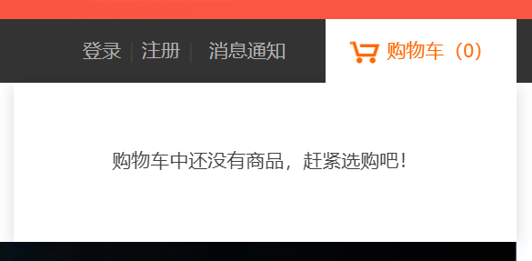

# 头部构建
` 2021/1/15 17:38`

排版

1. 确定结构，精准取名
   对于公共的部分可以加个共同的前缀比如"page-"或"pub-"

2. 头部分析

+ 将头部分为左右两部分，左边为一些链接的组合，右边为登录、注册、消息提示和购物车；
+ 注意：选择登陆后头部结构会发生变化，加入用户信息栏、登录注册部分变成“我的订单”

+ 在进行头部规划的时候应该考虑完整，包括改变部分
+ 购物车部分要考虑未加商品和添加商品的两种状态

+ 对于一行中显示文本过长部分省略号显示
  - white-space: nowrap;规定文本不换行
  - overflow: hidden;超出的部分隐藏
  - text-overflow: ellipsis;显示省略符号来代表被修剪的文本

+ 当内部使用float时，浮动的元素没有高度，此时padding不生效，要使用
  - overflow: hidden;

+ 当要取消列表最后一项的框线时
  - ` .page-top .pop .list li:last-child{border: none;}`
  - last-child可能有兼容问题，可以写成li.last,由后端判断是否为列表最后一项，如果是则会给列表最后一项加上class: ` <li class="last">`

了解：
> 了解display属性每个取值的含义和差别
> 了解float的本质